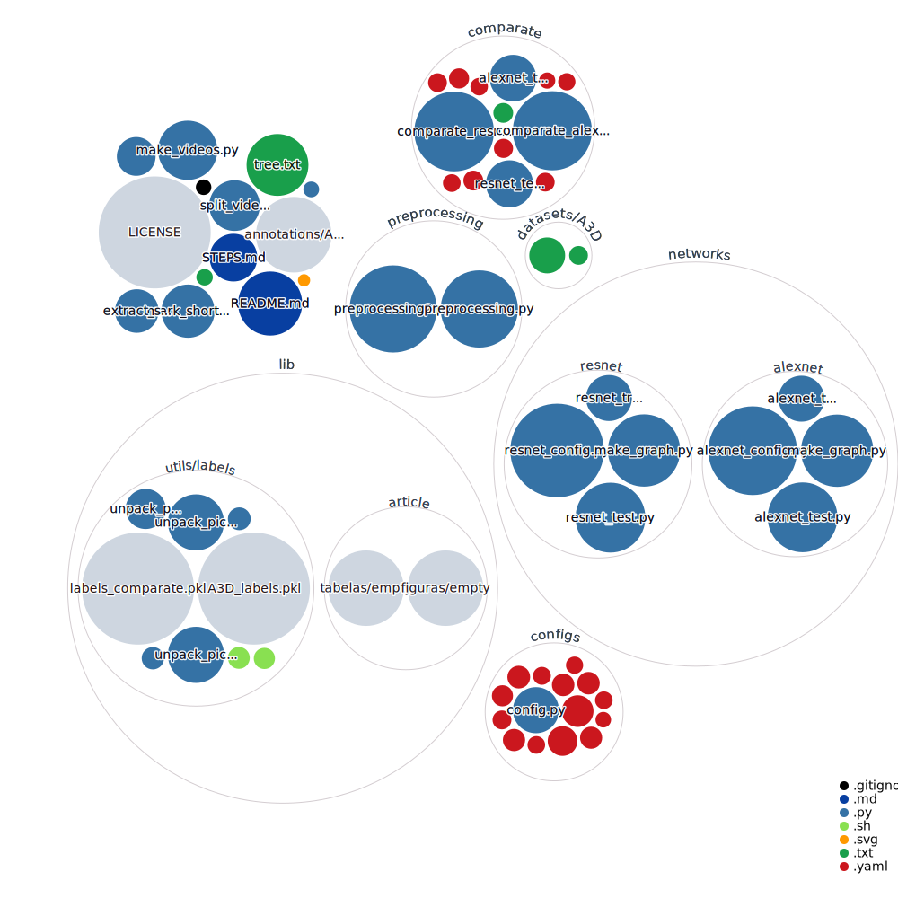

# SSADAT - Subsistema Autônomo de Detecção de Acidentes de Trânsito :oncoming_police_car:
## Artigo: **Aplicação de classificador binário por RNC na detecção de acidentes de trânsito**

_Soares, Augusto Carvalho; Pereira, Danilo César_

## Introdução
Os programas e scripts contidos neste repositório, intencionam-se a tarefa de detecção automática de acidentes, através de imagens coletadas de videos, usando Inteligência Artificial - IA e técnicas aprendizado de máquina não supervisionado.

> **Aviso:** Este código está em desenvolvimento. Por favor, não espere muito disso.

> **Aviso Legal:**
> Este trabalho foi desenvolvido com base em [tad-IROS2019](https://github.com/MoonBlvd/tad-IROS2019). Algumas partes podem se acemelhar (não superior a 10%), o unico arquivo totalmente copiado foi o da marcação de rótulos.

> :boom: **Repositório atualizado**, lista de vídeos atualizada!

#### Sistema Operacional:
Os códigos foram desenvolvidos em Python, no GNU/Linux(Slackware), e deverá ser executado em outras distribuições sem maiores problemas desde que supridos os requerimentos a seguir.

## Softwares
Para Executar os programas será necessário ter instalado:

	python	>= 3.8.6
	opencv	>= 4.1.2
	FFmpeg	>= 4.3.1

## :snake: Requerimentos Python

	Keras==2.4.3
	youtube_dl==2020.9.20
	numpy==1.18.5
	tensorflow==2.3.1
	pandas==1.1.3
	click==7.1.2
	opencv_contrib_python==4.4.0.44
	matplotlib==3.3.2
	PyYAML==5.3.1
	scikit_learn==0.23.2

### Opcionais (processamento paralelo)

	nvidia cudatoolkit	versão >= 10.2
	nvidia cudnn		versão >= 5.1

## Recomendações
Pela natureza do dataset (vídeos) e pela complexidade dos algoritmos de redes neurais, recomenda-se fortemente a execução em hardware minimamente compatível, alguns recursos são desejados como: processador multicore multithread, memória primária de 16GB, memória secundária SSD, GPU com suporte a núcleos CUDA.

## Execução veja arquivo [STEPS.md](STEPS.md)

## Visualização gráfica desde repositório

## Citações
Caso algo neste repositório lhe seja útil, esteja à vontade para nos citar:

	@article{Soares_Pereira_2021,
	  author={Soares, Augusto and Pereira, Danilo},
	  title={Aplicação de classificador binário por RNC na detecção de acidentes de trânsito},
	  journal={Revista Brasileira de Computação Aplicada},
	  volume={13},
	  number={2},
	  pages={28-37},
	  year={2021},
	  month={jun},
	  DOI={10.5335/rbca.v13i2.12466},
	  url={http://seer.upf.br/index.php/rbca/article/view/12466},
	  keywords={Acidente; AlexNet; Detecção; Rede Neural; ResNet-50}
	}

#### Nossos sinceros agradecimentos a Yao et al. pelo belo trabalho feito! Por ele tivemos inspiração para a nossa própria implementação.
